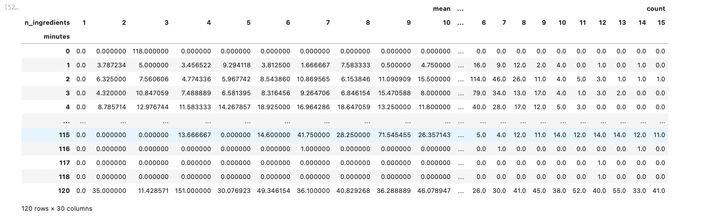
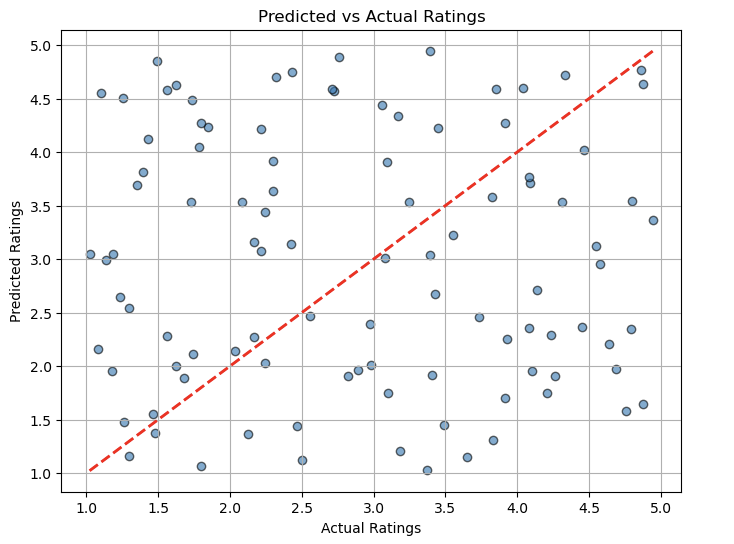
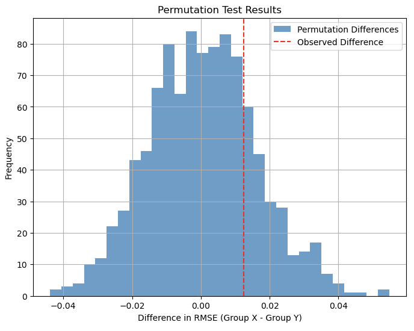

# recipe-ratings-analysis

## Introduction

This project analyzes two datasets: RAW_interactions.csv and RAW_recipes.csv. 
Together, they provide insights into user interactions with recipes, including 
ratings and reviews, and details about the recipes themselves.

The first dataset, RAW_interactions, contains 731,927 rows and 5 columns. It 
records user interactions with recipes, including the following columns:

- `user_id:` A unique identifier for each user.
- `recipe_id`: A unique identifier for each recipe.
- `date`: The date when the interaction occurred.
- `rating`: A numerical rating provided by the user for a recipe.
- `review`: A text review left by the user.

The second dataset, RAW_recipes, contains 83,782 rows and 12 columns. It 
provides detailed information about recipes, including:

- `name`: The name of the recipe.
- `id`: A unique identifier for the recipe.
- `minutes`: The time required to prepare the recipe.
- `contributor_id`: The unique identifier of the contributor who submitted 
the recipe.
- `submitted`: The date the recipe was submitted.
- `tags`: Tags describing the recipe's attributes (e.g., vegan, dessert).
- `nutrition`: Nutritional information for the recipe.
- `n_steps`: The number of steps required to complete the recipe.
- `steps`: A detailed list of instructions for the recipe.
- `description`: A brief description of the recipe.
- `ingredients`: A list of ingredients used in the recipe.
- `n_ingredients`: The number of ingredients used.

**Question of Interest:** How do user ratings and reviews correlate with recipe 
attributes such as preparation time, number of ingredients, and recipe tags? 
By exploring this, we can identify patterns and factors that contribute to 
highly-rated recipes, providing insights for both recipe creators and users.

**Why This Question Matters:** Understanding the connection between user 
preferences and recipe attributes can help improve recipe 
recommendations, enhance user experience, and guide recipe contributors in 
crafting popular recipes. This analysis is particularly valuable for culinary 
enthusiasts, content creators, and platforms hosting user-generated recipes.

## Data Cleaning and Exploratory Data analysis

I started by performing a left merge between the two datasets, `recipes` 
(RAW_recipes.csv) and `interactions` (RAW_interactions.csv) together on the 
`id` and `recipe_id` column. I then created an `avg_rating` dataframe that 
displays the means of each recipe, and then merged that with my original 
`recipes` DataFrame and used the `average_rating` column to serve as the 
ratings data for each recipe. Next, I cleaned the `nutrition` column to make the column values
actual lists rather than strings, and then proceeded to parse the cleaned
`nutrition` column to extract protein values. I used these values to define
"high-protein" and "low-protein" groups. The .head()  of the DataFrame is shown
below.

| name                                 |     id |   minutes |   contributor_id | submitted   | tags                                                                                                                                                                                                                                                                                               | nutrition                                     |   n_steps | steps                                                                                                                                                                                                                                                                                                                                                                                                                                                                                                                                                                                                                                                                                                                                                                                                                                                                                                                                                                                                                                                                                                                                                                                                                                                                                                                                                                               | description                                                                                                                                                                                                                                                                                                                                                                       | ingredients                                                                                                                                                                                                                             |   n_ingredients |   average_rating |   log_minutes |
|:-------------------------------------|-------:|----------:|-----------------:|:------------|:---------------------------------------------------------------------------------------------------------------------------------------------------------------------------------------------------------------------------------------------------------------------------------------------------|:----------------------------------------------|----------:|:------------------------------------------------------------------------------------------------------------------------------------------------------------------------------------------------------------------------------------------------------------------------------------------------------------------------------------------------------------------------------------------------------------------------------------------------------------------------------------------------------------------------------------------------------------------------------------------------------------------------------------------------------------------------------------------------------------------------------------------------------------------------------------------------------------------------------------------------------------------------------------------------------------------------------------------------------------------------------------------------------------------------------------------------------------------------------------------------------------------------------------------------------------------------------------------------------------------------------------------------------------------------------------------------------------------------------------------------------------------------------------|:----------------------------------------------------------------------------------------------------------------------------------------------------------------------------------------------------------------------------------------------------------------------------------------------------------------------------------------------------------------------------------|:----------------------------------------------------------------------------------------------------------------------------------------------------------------------------------------------------------------------------------------|----------------:|-----------------:|--------------:|
| 1 brownies in the world    best ever | 333281 |        40 |           985201 | 2008-10-27  | ['60-minutes-or-less', 'time-to-make', 'course', 'main-ingredient', 'preparation', 'for-large-groups', 'desserts', 'lunch', 'snacks', 'cookies-and-brownies', 'chocolate', 'bar-cookies', 'brownies', 'number-of-servings']                                                                        | [138.4, 10.0, 50.0, 3.0, 3.0, 19.0, 6.0]      |        10 | ['heat the oven to 350f and arrange the rack in the middle', 'line an 8-by-8-inch glass baking dish with aluminum foil', 'combine chocolate and butter in a medium saucepan and cook over medium-low heat , stirring frequently , until evenly melted', 'remove from heat and let cool to room temperature', 'combine eggs , sugar , cocoa powder , vanilla extract , espresso , and salt in a large bowl and briefly stir until just evenly incorporated', 'add cooled chocolate and mix until uniform in color', 'add flour and stir until just incorporated', 'transfer batter to the prepared baking dish', 'bake until a tester inserted in the center of the brownies comes out clean , about 25 to 30 minutes', 'remove from the oven and cool completely before cutting']                                                                                                                                                                                                                                                                                                                                                                                                                                                                                                                                                                                                   | these are the most; chocolatey, moist, rich, dense, fudgy, delicious brownies that you'll ever make.....sereiously! there's no doubt that these will be your fav brownies ever for you can add things to them or make them plain.....either way they're pure heaven!                                                                                                              | ['bittersweet chocolate', 'unsalted butter', 'eggs', 'granulated sugar', 'unsweetened cocoa powder', 'vanilla extract', 'brewed espresso', 'kosher salt', 'all-purpose flour']                                                          |               9 |                4 |       3.71357 |
| 1 in canada chocolate chip cookies   | 453467 |        45 |          1848091 | 2011-04-11  | ['60-minutes-or-less', 'time-to-make', 'cuisine', 'preparation', 'north-american', 'for-large-groups', 'canadian', 'british-columbian', 'number-of-servings']                                                                                                                                      | [595.1, 46.0, 211.0, 22.0, 13.0, 51.0, 26.0]  |        12 | ['pre-heat oven the 350 degrees f', 'in a mixing bowl , sift together the flours and baking powder', 'set aside', 'in another mixing bowl , blend together the sugars , margarine , and salt until light and fluffy', 'add the eggs , water , and vanilla to the margarine / sugar mixture and mix together until well combined', 'add in the flour mixture to the wet ingredients and blend until combined', 'scrape down the sides of the bowl and add the chocolate chips', 'mix until combined', 'scrape down the sides to the bowl again', 'using an ice cream scoop , scoop evenly rounded balls of dough and place of cookie sheet about 1 - 2 inches apart to allow for spreading during baking', 'bake for 10 - 15 minutes or until golden brown on the outside and soft & chewy in the center', 'serve hot and enjoy !']                                                                                                                                                                                                                                                                                                                                                                                                                                                                                                                                                  | this is the recipe that we use at my school cafeteria for chocolate chip cookies. they must be the best chocolate chip cookies i have ever had! if you don't have margarine or don't like it, then just use butter (softened) instead.                                                                                                                                            | ['white sugar', 'brown sugar', 'salt', 'margarine', 'eggs', 'vanilla', 'water', 'all-purpose flour', 'whole wheat flour', 'baking soda', 'chocolate chips']                                                                             |              11 |                5 |       3.82864 |
| 412 broccoli casserole               | 306168 |        40 |            50969 | 2008-05-30  | ['60-minutes-or-less', 'time-to-make', 'course', 'main-ingredient', 'preparation', 'side-dishes', 'vegetables', 'easy', 'beginner-cook', 'broccoli']                                                                                                                                               | [194.8, 20.0, 6.0, 32.0, 22.0, 36.0, 3.0]     |         6 | ['preheat oven to 350 degrees', 'spray a 2 quart baking dish with cooking spray , set aside', 'in a large bowl mix together broccoli , soup , one cup of cheese , garlic powder , pepper , salt , milk , 1 cup of french onions , and soy sauce', 'pour into baking dish , sprinkle remaining cheese over top', 'bake for 25 minutes or until cheese is lightly browned', 'sprinkle with rest of french fried onions and bake until onions are browned and cheese is bubbly , about 10 more minutes']                                                                                                                                                                                                                                                                                                                                                                                                                                                                                                                                                                                                                                                                                                                                                                                                                                                                               | since there are already 411 recipes for broccoli casserole posted to "zaar" ,i decided to call this one  #412 broccoli casserole.i don't think there are any like this one in the database. i based this one on the famous "green bean casserole" from campbell's soup. but i think mine is better since i don't like cream of mushroom soup.submitted to "zaar" on may 28th,2008 | ['frozen broccoli cuts', 'cream of chicken soup', 'sharp cheddar cheese', 'garlic powder', 'ground black pepper', 'salt', 'milk', 'soy sauce', 'french-fried onions']                                                                   |               9 |                5 |       3.71357 |
| millionaire pound cake               | 286009 |       120 |           461724 | 2008-02-12  | ['time-to-make', 'course', 'cuisine', 'preparation', 'occasion', 'north-american', 'desserts', 'american', 'southern-united-states', 'dinner-party', 'holiday-event', 'cakes', 'dietary', 'christmas', 'thanksgiving', 'low-sodium', 'low-in-something', 'taste-mood', 'sweet', '4-hours-or-less'] | [878.3, 63.0, 326.0, 13.0, 20.0, 123.0, 39.0] |         7 | ['freheat the oven to 300 degrees', 'grease a 10-inch tube pan with butter , dust the bottom and sides with flour , and set aside', 'in a large mixing bowl , cream the butter and sugar with an electric mixer and add the eggs one at a time , beating after each addition', 'alternately add the flour and milk , stirring till the batter is smooth', 'add the two extracts and stir till well blended', 'scrape the batter into the prepared pan and bake till a cake tester or knife blade inserted in the center comes out clean , about 1 1 / 2 hours', 'cool the cake in the pan on a rack for 5 minutes , then turn it out on the rack to cool completely']                                                                                                                                                                                                                                                                                                                                                                                                                                                                                                                                                                                                                                                                                                               | why a millionaire pound cake?  because it's super rich!  this scrumptious cake is the pride of an elderly belle from jackson, mississippi.  the recipe comes from "the glory of southern cooking" by james villas.                                                                                                                                                                | ['butter', 'sugar', 'eggs', 'all-purpose flour', 'whole milk', 'pure vanilla extract', 'almond extract']                                                                                                                                |               7 |                5 |       4.79579 |
| 2000 meatloaf                        | 475785 |        90 |          2202916 | 2012-03-06  | ['time-to-make', 'course', 'main-ingredient', 'preparation', 'main-dish', 'potatoes', 'vegetables', '4-hours-or-less', 'meatloaf', 'simply-potatoes2']                                                                                                                                             | [267.0, 30.0, 12.0, 12.0, 29.0, 48.0, 2.0]    |        17 | ['pan fry bacon , and set aside on a paper towel to absorb excess grease', 'mince yellow onion , red bell pepper , and add to your mixing bowl', 'chop garlic and set aside', 'put 1tbsp olive oil into a saut pan , along with chopped garlic , teaspoons white pepper and a pinch of kosher salt', 'bring to a medium heat to sweat your garlic', 'preheat oven to 350f', 'coarsely chop your baby spinach add to your heated pan , stir frequently for approximately 5 min to wilt', 'add your spinach to the mixing bowl', 'chop your now cooled bacon , and add it to the mixing bowl', 'add your meatloaf mix to the bowl , with one egg and mix till thoroughly combined', 'add your goat cheese , one egg , 1 / 8 tsp white pepper and 1 / 8 tsp of kosher salt and mix till thoroughly combined', 'transfer to a 9x5 meatloaf pan , and cook for 60 min or until the internal temperature is at least 160f', 'let stand for 5min', 'melt 1tbsp unsalted butter into a frying pan , and cook up to three eggs at a time', 'crack each egg into a separate dish , in order to prevent egg shells from reaching the pan , then add salt and pepper to taste', 'wait until the egg whites are firm looking , but slightly runny on top before flipping your eggs', 'after flipping , wait 10~20 seconds before removing each egg and placing it over your slices of meatloaf'] | ready, set, cook! special edition contest entry: a mediterranean flavor inspired meatloaf dish. featuring: simply potatoes - shredded hash browns, egg, bacon, spinach, red bell pepper, and goat cheese.                                                                                                                                                                         | ['meatloaf mixture', 'unsmoked bacon', 'goat cheese', 'unsalted butter', 'eggs', 'baby spinach', 'yellow onion', 'red bell pepper', 'simply potatoes shredded hash browns', 'fresh garlic', 'kosher salt', 'white pepper', 'olive oil'] |              13 |                5 |       4.51086 |

Then created a couple of distributions of some of the relevant columns in the 
`recipes` dataframe. An example of one such distribution is shown below.

<iframe
  src="assets/log-minutes-plotly.html"
  width="500"
  height="375"
  frameborder="0"
></iframe>

Then proceeded to analyze pairs of columns to check for positive associations.
An example of a pair of columns that showed a weaker association is shown below.

<iframe
  src="assets/minutes-ratings.html"
  width="500"
  height="375"
  frameborder="0"
></iframe>

I then created a pivot table. I used the `minutes` column and pivotted by the
`n_ingredients' column. I filtered out data entries that listed over 10000 
minutes to make as these were not "real" recipes and were posted in the data as
a sort of joke, and entries that had over 15 ingredients since a vast majority 
of the recipes required 15 or less ingredients. The resulting pivot table is 
shown below.



## Assessment of Missingness

I believe that the `description` column is NMAR (Not Missing At Random). After
running several permutation tests on the data in the `recipes` DataFrame, there
were a couple columns, `n_ingredients` and `average_rating`, that the
missingness of descriptions depended on. I parsed through the dataset and ran 
permutation tests on each column using this function

```py
def permutation_test_fast(col_missing, col_other, n_permutations=500):
    col_other_array = col_other.to_numpy()
    col_missing_array = col_missing.to_numpy()
    observed_stat = col_other_array[col_missing_array].mean() - col_other_array[~col_missing_array].mean()
    perm_stats = []
    for _ in range(n_permutations):
        shuffled = np.random.permutation(col_other_array)
        perm_stat = shuffled[col_missing_array].mean() - shuffled[~col_missing_array].mean()
        perm_stats.append(perm_stat)
    p_value = np.mean(np.abs(perm_stats) >= np.abs(observed_stat))
    return observed_stat, p_value, perm_stats
```

A `plotly` plot that demonstrates such missingness exploration is shown below

<iframe
  src="assets/ingredients-missingness.html"
  width="500"
  height="375"
  frameborder="0"
></iframe>

## Hypothesis Testing

#### Question: Do recipes with more protein have higher average ratings?

- Null Hypothesis: There is no difference in the average ratings of recipes with 
higher protein content compared to those with lower protein count

- Alternate Hypothesis: Recipes with higher protein count tend to have higher average ratings

The test was performed using the "difference in means" test-statistic at the 
0.05 significance level. The code for the hypothesis test is:

```py
from scipy.stats import ttest_ind

#Perform a two-sample t-test
t_stat, p_val = ttest_ind(high_protein, low_protein, nan_policy='omit')

# Output results
print(f"T-statistic: {t_stat}, P-value: {p_val}")

alpha = 0.05  # Significance level
if p_val < alpha:
    print("Reject the null hypothesis: Recipes with higher protein content have higher average ratings.")
else:
    print("Fail to reject the null hypothesis: No significant difference in ratings.")
```

The p-value was 0.79, which means we failed to reject the null hypothesis. In 
other words, the test indicates that there was no statistically significant
difference in the average ratings of recipes with higher protein content 
than those with lower protein count.

I visualization pertinent to this hypothesis test is below

<iframe
  src="assets/hypothesis-test-visualization.html"
  width="500"
  height="375"
  frameborder="0"
></iframe>

## Framing a Prediction Problem

The prediction problem I chose was to predict the ratings of recipes, which is
a Regression problem. We are going to target the `average_rating` (continuous)
variable because it directly represents the aggregated user feedback (ratings) 
for each recipe. It's the outcome I want to predict. Features and the target 
are defined using the code below. 

```py
nutrition_cols = ['calories', 'fat', 'sugar', 'sodium', 'protein', 'saturated_fat', 'carbs']
features = recipes[['minutes', 'n_steps', 'n_ingredients'] + nutrition_cols]
target = recipes['average_rating']

```

The metric I am going to use for my model is Root Mean Squared Error (RMSE). I am using RMSE because it 
measures the average prediction error in the same units as the target variable
(`average_rating`). making it interpretable. RMSE also penalizes large errors 
more than small ones, which is important when predicting user ratings because 
significant prediction errors (e.g., predicting 2.0 instead of 5.0) can lead to 
poor recommendations.

## Baseline Model 

The baseline model uses a linear regression algorithm with one quantitative 
feature (`minutes`) and one nominal feature (`tags`), which was encoded using 
one-hot encoding. While the model serves as a simple starting point, its 
performance is poor, with an RMSE of 0.6509 and an R² of -0.0480. This suggests 
that the current features and linear approach do not adequately explain the 
variance in `average_rating`. Future models will incorporate additional features 
and more complex algorithms to improve performance.

## Final Model

#### Features added:
- **Log-transformed Minutes** (`log_minutes`): This transformation helps 
normalize the distribution of the `minutes` feature, which is often skewed. 
It likely reduces the influence of extreme outliers and captures diminishing 
returns in cooking time on recipe ratings.
- **Protein-to-Calorie Ratio** (`protein_calorie_ratio'): This feature provides 
insight into the nutritional density of a recipe. It reflects the balance of 
protein relative to calories, which could influence how recipes are perceived 
as healthy or satisfying.

These features were selected based on their potential relationship to user 
preferences and recipe quality:
1. `log_minutes` caputres the realistic diminishing impact of preparation time 
on user satisfaction.
2. `protein_calorie_ratio` highlights the importance of nutrition in predicting 
recipe ratings, as health-conscious users may prefer recipes with higher 
protein density.

#### Modeling Algorithm and Hyperparamters

- **Model Algorithm:** Lasso regression was chosen because it performs feature 
selection by shrinking coefficients of less important features to zero. This is 
especially useful given the large number of features in the dataset.
- **Hyperparamter Tuning:**
  - **Best Hyperparamter** (`alpha`): he optimal value was determined to be 
  `0.1` using a grid search with cross-validation.
  - **Tuning Method:** A grid search with five-fold cross-validation was 
  conducted to identify the best value for the `alpha` parameter, balancing 
  model complexity and performance.

The comparison to the Baseline Model is shown below:

| Metric     |   Baseline |  Final |
|:-----------|------------|-------:|
| RMSE   |         0.6509 | 0.6355 |   
| R^2    |         -0.0480| 0.0010 |

The final model slightly improved the RMSE, indicating a better fit to the 
data. The value R^2, while still low, improved to a positive value, suggesting 
a marginal gain in the model's explanatory power.

I visualization (scatter plot) omparing the predicted vs. actual ratings for \
the test set is shown below.



## Fairness Analysis

#### Group and metric definition

My **Group X** is recipes with fewer than the median number of ingredients, and 
my **Group Y** is recipes with the median number or more ingredients. My 
evaluation metric is **RMSE**, which measures the model's prediction error.

#### Hypotheses

- **Null Hypothesis** (H~0): The model performs equally well for both groups, 
and any observed differences in RMSE are due to random chance.
- **Alternate Hypothesis** (H~1): The model performs worse for Group X 
(higher RMSE) compared to Group Y.

The test statistic is the **difference in RMSE** between Group X and Group Y. 
The test was performed at the α = 0.05 significance level.

The results were

| Metric              |   Value |
|:--------------------|--------:|
| RMSE~X              |  0.6422 |
| RMSE~Y              |  0.6297 |
| Observed Difference |  0.0124 |
| P-value             |  0.1064 |

#### Conclusion

At the significance level of 0.05, the p-value of 0.1064 indicates that the 
observed difference in RMSE between Group X and Group Y is not statistically 
significant. Thus, we fail to reject the null hypothesis and conclude that 
there is no strong evidence of unfairness in the model's performance for these 
two groups.

Visualization for the permutation test:

